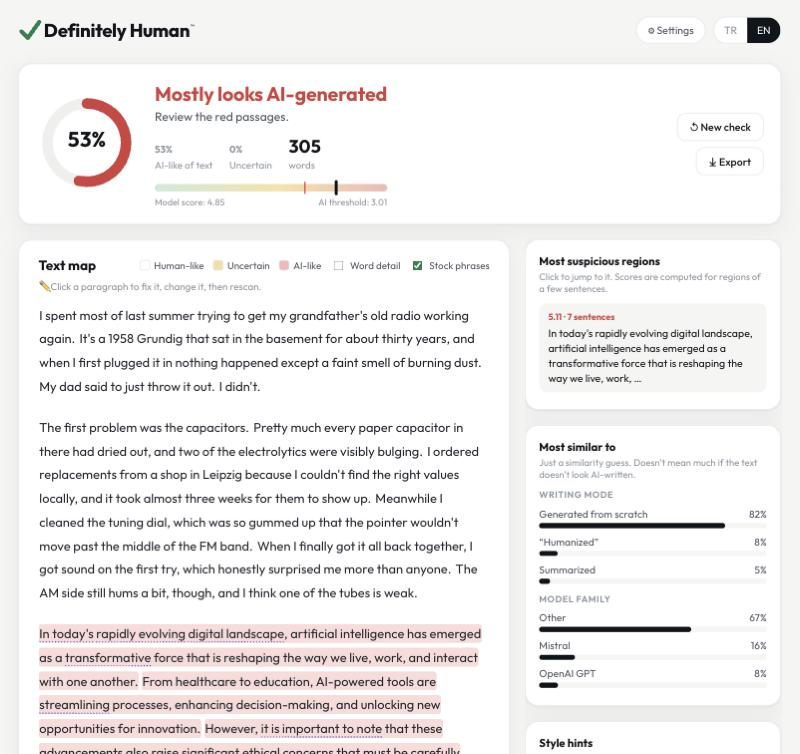

<p align="center"></p>

<h1 align="center">Definitely Human™</h1>

<p align="center"><b>Offline, explainable AI-text checker for English essays, papers and theses.</b><br>
Paste text or drop a Word/PDF file. Instead of one opaque percentage, it shows <b>which parts</b> read as AI-written.</p>

<p align="center">
  <a href="https://github.com/Ogdeveloperc/definitely-human/releases/latest/download/DefinitelyHuman-Indir-Kur.cmd"><b>⬇ Download for Windows</b></a> ·
  <a href="#install-windows">Install guide</a> ·
  <a href="#kurulum-windows">🇹🇷 Türkçe kurulum</a>
</p>

<p align="center"></p>

---

## What it does

- **Runs on your own computer.** No account, no API, no cloud. Your text never leaves the PC.
- **Shows where, not just how much.** A green / yellow / red map of the text, a list of the most suspicious regions, and the overall result.
- **Fix and rescan.** Click a flagged paragraph, rewrite it right there, rescan, and see the before/after numbers.
- **Export** the edited text as Word (.docx) or .txt, or save a coloured report (.html, printable to PDF).
- **Word, PDF and scanned PDF** files. Reference lists, running headers and page numbers are removed automatically.
- **Learns your style.** Add a few texts you wrote before 2022 so your own writing isn't flagged by mistake.
- **Honest explanations.** Everything shown is measured: model scores per region, word emphasis, style statistics (sentence-length variety, stock phrases like "delve" or "it is important to note", em dashes). Nothing is made up by a chatbot.
- **English only.** Other languages are recognised and not scored.

> **No AI detector is proof.** Red means "take another look", not "this was written by AI". Formal, plain or
> academic writing can be flagged by mistake.

<a id="install-windows"></a>
## Install (Windows)

### What you need
- Windows 10 or 11 (64-bit)
- **About 15 GB free** on drive C:
- **Internet**, only during installation and the one-time calibration
- **An NVIDIA graphics card is recommended** (tested target: RTX 5070). Without one it still works, just slower.
  Update the NVIDIA driver first (NVIDIA App / GeForce Experience → Drivers).

### Steps
1. **Download** [`DefinitelyHuman-Indir-Kur.cmd`](https://github.com/Ogdeveloperc/definitely-human/releases/latest/download/DefinitelyHuman-Indir-Kur.cmd).
   If the browser warns that this file type can be harmful, choose **Keep**.
2. **Double-click** the downloaded file. A window opens and fetches the newest installer.
   If Windows shows **"Windows protected your PC"**, click **More info → Run anyway**
   (the installer is open source but not code-signed, which is why Windows asks).
3. Allow administrator access, then click **Next → Install** in the setup wizard.
4. A black window downloads Python, the GPU version of PyTorch and the models (**about 7 GB**, 10–30 minutes).
   **Don't close it**; it closes itself when done.
5. Open **Definitely Human** from the desktop. The app opens in your browser.
6. On first start you'll see **Finish setup**. Click **Start calibration** (15–30 minutes on an RTX graphics card;
   needs internet, about 800 MB). This measures where green/yellow/red should start on *your* computer. It's done once.
7. Check **Settings → Hardware**: it should show **⚡ your graphics card**. If it says *CPU mode (slow)*,
   update the NVIDIA driver and restart the app.

Prefer doing it by hand? Download `DefinitelyHuman-Setup-x.y.z.exe` from
[Releases](https://github.com/Ogdeveloperc/definitely-human/releases/latest) and run it; it does steps 3–4.

### Using it
- Paste English text (at least ~100 words) or drop a .docx / .pdf / .txt file, pick the document type
  (essay / paper or thesis / other) and click **Analyze**.
- Hover a highlighted region to see its score. Click any paragraph to edit it, then **Rescan**.
- **Settings → Learn my writing:** add 3–10 texts you wrote *before ChatGPT* (2022 or earlier). Your own style
  then won't turn red. Thresholds can only go up from this, never down.
- Closing the browser tab also closes the app after a minute or two.

### Updates
The app shows a green notice when a new version is out. Run the same `.cmd` file again (or the new Setup.exe):
it installs over the old version and keeps the model, settings and calibration.

### Uninstall
Windows **Settings → Apps → Installed apps → Definitely Human → Uninstall**. This removes `C:\DefinitelyHuman` completely.

### Troubleshooting
| Problem | Fix |
|---|---|
| Setup window shows an error | Check the internet connection and run the `.cmd` file again. It picks up where it stopped. |
| App says *CPU mode (slow)* or *driver outdated* | **Settings → Hardware** shows your driver version and the minimum needed (570.65). Click **Update driver**: it opens NVIDIA App (or NVIDIA's driver page). Update, restart the computer, open the app again. |
| App doesn't open or behaves oddly | Start menu → **Definitely Human - Repair**. |
| Something else | Open an [issue](https://github.com/Ogdeveloperc/definitely-human/issues) and attach `C:\DefinitelyHuman\data\app.log`. |

<a id="kurulum-windows"></a>
## 🇹🇷 Kurulum (Windows)

### Gerekenler
- Windows 10 veya 11 (64-bit)
- C: diskinde **yaklaşık 15 GB boş yer**
- **İnternet**: sadece kurulum ve bir kerelik kalibrasyon sırasında
- **NVIDIA ekran kartı önerilir** (hedef: RTX 5070). Yoksa da çalışır, sadece daha yavaş olur.
  Önce NVIDIA sürücüsünü güncelleyin (NVIDIA App / GeForce Experience → Sürücüler).

### Adımlar
1. [`DefinitelyHuman-Indir-Kur.cmd`](https://github.com/Ogdeveloperc/definitely-human/releases/latest/download/DefinitelyHuman-Indir-Kur.cmd)
   dosyasını **indirin**. Tarayıcı "bu dosya türü zarar verebilir" derse **Sakla / Keep** deyin.
2. İndirilen dosyaya **çift tıklayın**. Açılan pencere en yeni kurulum dosyasını indirir.
   **"Windows bilgisayarınızı korudu"** uyarısı çıkarsa **Ek bilgi → Yine de çalıştır** deyin.
   Program açık kaynak ama dijital imzası yok, Windows bu yüzden soruyor.
3. Yönetici izni isteyince **Evet** deyin, kurulum sihirbazında **İleri → Kur**.
4. Siyah bir pencere Python'u, ekran kartı destekli PyTorch'u ve modelleri indirir (**yaklaşık 7 GB**, 10-30 dakika).
   **Kapatmayın**, bitince kendisi kapanır.
5. Masaüstündeki **Definitely Human** simgesine çift tıklayın. Program tarayıcıda açılır.
6. İlk açılışta **"Kurulumu tamamla"** ekranı gelir. **"Kalibrasyonu başlat"** deyin (RTX ekran kartında 15-30 dakika,
   internet gerekir, yaklaşık 800 MB). Bu adım, yeşil/sarı/kırmızının nereden başlayacağını *sizin* bilgisayarınızda
   ölçer. Bir kere yapılır.
7. **Ayarlar → Donanım** kısmında **⚡ ekran kartınızın adı** yazmalı. *İşlemci modu (yavaş)* yazıyorsa
   NVIDIA sürücüsünü güncelleyip programı yeniden açın.

Elle kurmak isterseniz [Releases](https://github.com/Ogdeveloperc/definitely-human/releases/latest) sayfasından
`DefinitelyHuman-Setup-x.y.z.exe` dosyasını indirip çalıştırın. 3. ve 4. adımları yapar.

### Kullanım
- İngilizce metni yapıştırın (en az ~100 kelime) ya da .docx / .pdf / .txt dosyasını sürükleyin, belge türünü seçin
  (ödev / makale-tez / diğer) ve **Analiz et**'e basın.
- Renkli bölgelerin üzerine gelince skorunu görürsünüz. Herhangi bir paragrafa tıklayıp düzeltin, sonra **Yeniden tara**.
- **Ayarlar → Benim yazılarımı tanı:** *ChatGPT'den önce* (2022 ve öncesi) yazdığınız 3-10 metni ekleyin.
  Kendi tarzınız artık kırmızı yanmaz. Eşikler bununla sadece yükselebilir, asla düşmez.
- Tarayıcı sekmesini kapatınca program da 1-2 dakika içinde kendiliğinden kapanır.

### Güncelleme
Yeni sürüm çıkınca program yeşil bir bildirim gösterir. Aynı `.cmd` dosyasını tekrar çalıştırın (ya da yeni Setup.exe'yi).
Eski sürümün üzerine kurar; model, ayarlar ve kalibrasyon korunur.

### Kaldırma
Windows **Ayarlar → Uygulamalar → Yüklü uygulamalar → Definitely Human → Kaldır**. `C:\DefinitelyHuman` tamamen silinir.

### Sorun giderme
| Sorun | Çözüm |
|---|---|
| Kurulum penceresi hata veriyor | İnterneti kontrol edip `.cmd` dosyasını tekrar çalıştırın, kaldığı yerden devam eder. |
| Program *İşlemci modu (yavaş)* ya da *sürücü eski* diyor | **Ayarlar → Donanım** sürücü sürümünüzü ve gereken en az sürümü (570.65) gösterir. **Sürücüyü güncelle**'ye basın: NVIDIA App (ya da NVIDIA'nın sürücü sayfası) açılır. Güncelleyin, bilgisayarı yeniden başlatın, programı tekrar açın. |
| Program açılmıyor / garip davranıyor | Başlat menüsü → **Definitely Human - Repair**. |
| Başka bir sorun | Bir [issue](https://github.com/Ogdeveloperc/definitely-human/issues) açın, `C:\DefinitelyHuman\data\app.log` dosyasını ekleyin. |

## Privacy

Analysis happens entirely on your computer. The app only goes online to: install itself, download calibration
data once, and check GitHub for a newer version number at start (turn this off in Settings). Your texts are never sent anywhere.

## How it works

The detector is **MELD** (Li, Wan, Chen, Paetzold; [arXiv:2605.06903](https://arxiv.org/abs/2605.06903)), the strongest
open-source model on the RAID benchmark: a 1-billion-parameter text encoder, not a chat model.
Weights: [odeveloper/meld](https://huggingface.co/odeveloper/meld) (verified mirror) /
[anon-review-meld-2026/meld](https://huggingface.co/anon-review-meld-2026/meld) (original).

1. **Whole document.** MELD's own calibrated scoring of the full text gives the overall verdict and which model family
   and writing mode (generated, polished, paraphrased…) it most resembles.
2. **Regions.** MELD reads its whole input at once, so AI text "bleeds" into the human text next to it. Each sentence
   therefore starts its own short window (about 60 words), every window is scored separately, and a sentence's score
   is the **lowest** of the windows that contain it: if any window around a sentence reads clean, so does the sentence.
3. **Calibration.** The red/yellow thresholds are set on thousands of real human and 2026-model texts so that at most
   about 5% of fully human, thesis-length (~8,000-word) documents show *any* red region, with at least two sentences
   needed for a red run. It also reports how many AI sentences get caught in mixed human+AI documents.
   See [`backend/definitely_human/calib.py`](backend/definitely_human/calib.py).

## Develop

```bash
uv sync                                # Python 3.12 + deps (macOS: CPU/MPS torch; Windows: CUDA 12.8 torch)
uv run definitely-human download       # fetch the models into models/
cd frontend && npm install && npm run build && cd ..
uv run definitely-human serve          # http://127.0.0.1:8765
uv run definitely-human check essay.docx --domain essay
PYTHONPATH=backend uv run pytest -q tests
```

Calibrate from the command line (GPU strongly recommended):

```bash
uv run python eval/run_windows.py --per-kind 150
uv run python eval/calibrate.py --write
```

Release: bump `version` in `pyproject.toml`, tag `vX.Y.Z`, push. GitHub Actions builds the installer, installs it on a
Windows runner, analyzes sample Word / PDF / scanned-PDF files, and attaches the `.exe` and the one-click `.cmd` to the release.

## License

MIT. See [THIRD_PARTY.md](THIRD_PARTY.md) for the model, fonts, OCR and data used.
